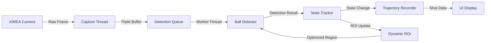

# 🏌️ Golf Putting Analysis System - Technical Documentation

## 📋 목차
1. [시스템 개요](#시스템-개요)
2. [아키텍처 설계](#아키텍처-설계)
3. [핵심 컴포넌트](#핵심-컴포넌트)
4. [볼 추적 알고리즘](#볼-추적-알고리즘)
5. [실시간 처리 파이프라인](#실시간-처리-파이프라인)
6. [API 레퍼런스](#api-레퍼런스)
7. [UI 시스템](#ui-시스템)
8. [성능 최적화](#성능-최적화)
9. [데이터 형식](#데이터-형식)
10. [트러블슈팅](#트러블슈팅)

---

## 🎯 시스템 개요

### 프로젝트 목적
XIMEA 고속 카메라를 이용하여 골프 퍼팅 시 공의 움직임을 실시간으로 추적하고 분석하는 비전 시스템

### 주요 기능
- ✅ **실시간 볼 감지** (120 FPS)
- ✅ **볼 상태 추적** (5단계 상태 머신)
- ✅ **퍼팅 궤적 기록 및 분석**
- ✅ **Dynamic ROI 최적화**
- ✅ **샷 완료 자동 감지**
- ✅ **궤적 데이터 저장 및 시각화**

### 기술 스택
```
C++ 17 | OpenCV 4.x | XIMEA API | MFC | GDI+ | Multi-threading
```

---

## 🏗️ 아키텍처 설계

### 시스템 계층 구조

```
┌───────────────────────────────────────────────┐
│          MFC UI Application (EXE)             │
│         XIMEASensorDiagDlg                    │
├───────────────────────────────────────────────┤
│           C API Interface Layer               │
│         XIMEASensor.dll (Export)              │
├───────────────────────────────────────────────┤
│          Core Processing Engine               │
│  ┌─────────────────────────────────────────┐  │
│  │     CameraController (Singleton)        │  │
│  ├─────────────────────────────────────────┤  │
│  │  • Frame Capture Thread                 │  │
│  │  • Ball Detection Worker Thread         │  │
│  │  • State Tracking System                │  │
│  │  • Trajectory Recording                 │  │
│  └─────────────────────────────────────────┘  │
├───────────────────────────────────────────────┤
│         Hardware Abstraction Layer            │
│  ┌─────────────────────────────────────────┐  │
│  │    ICameraInterface (Abstract)          │  │
│  ├─────────────────────────────────────────┤  │
│  │    XIMEACameraImpl : ICameraInterface   │  │
│  └─────────────────────────────────────────┘  │
├───────────────────────────────────────────────┤
│            XIMEA Hardware Driver              │
│              xiApi.dll (SDK)                  │
└───────────────────────────────────────────────┘
```

### 데이터 플로우



---

## 🔧 핵심 컴포넌트

### 1. CameraController (Singleton Pattern)

카메라 제어와 모든 처리 로직을 관리하는 중앙 컨트롤러

```cpp
class CameraController {
private:
    // Singleton 인스턴스
    static std::unique_ptr<CameraController> instance;
    
    // 카메라 인터페이스
    std::unique_ptr<ICameraInterface> cameraInterface;
    void* cameraHandle;
    
    // 스레드 관리
    std::thread captureThread;          // 프레임 캡처
    std::thread m_detectionThread;      // 볼 감지
    
    // 트리플 버퍼링
    std::array<ImageBuffer, 3> buffers;
    std::atomic<int> writeIndex{0};
    std::atomic<int> readIndex{1};
    std::atomic<int> displayIndex{2};
    
    // 볼 추적 시스템
    BallTrackingData m_ballTracking;
    BallStateConfig m_ballStateConfig;
    
    // 궤적 데이터
    ShotTrajectoryData m_currentShotData;
};
```

### 2. Ball Detection System

#### BallDetector 클래스 구조
```cpp
class BallDetector {
    // 감지 파라미터
    BallDetectorParams params {
        .minRadius = 5,
        .maxRadius = 50,
        .minCircularity = 0.7f,
        .minInertiaRatio = 0.4f,
        .minConvexity = 0.8f
    };
    
    // OpenCV SimpleBlobDetector 사용
    cv::Ptr<cv::SimpleBlobDetector> detector;
    
    // 후처리 필터
    KalmanFilter positionFilter;
    MedianFilter radiusFilter;
};
```

### 3. State Machine Implementation

```cpp
enum class BallState {
    NOT_DETECTED = 0,  // 공 미감지
    MOVING = 1,        // 이동 중
    STABILIZING = 2,   // 감속 중
    READY = 3,         // 퍼팅 준비
    STOPPED = 4        // 샷 완료
};
```

---

## 🎱 볼 추적 알고리즘

### 1. 향상된 움직임 감지 시스템

#### 핵심 데이터 구조
```cpp
struct BallTrackingData {
    // 위치 히스토리 (30프레임 = 0.5초 @ 120fps)
    std::deque<cv::Point2f> positionHistory;
    
    // 프레임간 변화량 추적 (20프레임)
    std::deque<float> frameDeltas;
    
    // 누적 이동 추적
    float recentAccumulatedMovement;    // 최근 10프레임
    float totalAccumulatedMovement;     // 전체 누적
    
    // 동적 임계값
    float currentMovementThreshold;     // 기본 3.0px
    float currentStabilityThreshold;    // 기본 1.5px
    
    // 노이즈 레벨 추정
    float movementNoiseLevel;           // 표준편차 기반
};
```

#### 움직임 감지 알고리즘

```cpp
bool ShouldStartMoving(const BallTrackingData& tracking, float pixelDelta) {
    // 1. 즉각적인 큰 움직임
    if (pixelDelta > tracking.currentMovementThreshold * 2) {
        return true;
    }
    
    // 2. 일관된 움직임 패턴 (최근 5프레임 중 3프레임)
    if (tracking.HasConsistentMovement()) {
        return true;
    }
    
    // 3. 느린 움직임 감지 (누적)
    if (tracking.DetectSlowMovement()) {
        // recentAccumulatedMovement > threshold * 5
        return true;
    }
    
    // 4. 연속 움직임 프레임
    if (tracking.consecutiveMovingFrames >= 3) {
        return true;
    }
    
    return false;
}
```

### 2. 상태 전환 조건

#### NOT_DETECTED → MOVING/STABILIZING
```cpp
if (consecutiveDetections >= minConsecutiveDetections) {
    if (움직임_감지) {
        state = MOVING;
    } else {
        state = STABILIZING;
    }
}
```

#### MOVING → STABILIZING
```cpp
if (consecutiveStableFrames >= requiredStableFramesForStop ||
    IsDefinitelyStable() ||
    (consecutiveStableFrames >= 10 && 
     recentAccumulatedMovement < threshold * 5)) {
    state = STABILIZING;
}
```

#### STABILIZING → READY/STOPPED
```cpp
if (stableDuration >= stabilizingTimeMs) {
    if (recordingTrajectory) {
        state = STOPPED;  // 샷 완료
    } else {
        state = READY;    // 다음 샷 준비
    }
}
```

#### READY → MOVING
```cpp
if (pixelDelta > movementThreshold ||
    distanceFromReady > movementThreshold * 2 ||
    HasConsistentMovement() ||
    DetectSlowMovement()) {
    state = MOVING;
    StartTrajectoryRecording();  // 궤적 기록 시작
}
```

### 3. 노이즈 필터링

```cpp
void UpdateDynamicThresholds() {
    // 노이즈 레벨 계산 (표준편차)
    float variance = CalculateVariance(frameDeltas);
    movementNoiseLevel = sqrt(variance) + 0.5f;
    
    // 동적 임계값 조정
    currentMovementThreshold = max(2.0f, movementNoiseLevel * 2.0f);
    currentStabilityThreshold = max(1.0f, movementNoiseLevel * 1.5f);
    
    // MOVING 상태에서는 더 민감하게
    if (currentState == BallState::MOVING) {
        currentStabilityThreshold *= 0.8f;
    }
}
```

---

## ⚡ 실시간 처리 파이프라인

### 1. Triple Buffering System

```cpp
// 3개 버퍼 순환으로 프레임 드롭 최소화
void CaptureLoop() {
    while (isRunning) {
        // 1. 카메라에서 프레임 획득
        Camera::GetImage(handle, timeout, &image);
        
        // 2. Write 버퍼에 복사
        auto& writeBuffer = buffers[writeIndex];
        memcpy(writeBuffer.data.get(), image.bp, imageSize);
        writeBuffer.ready = true;
        
        // 3. 버퍼 인덱스 스왑 (원자적)
        SwapBuffers();  // write → read → display → write
        
        // 4. 감지 큐에 추가
        if (m_realtimeDetectionEnabled) {
            m_detectionQueue.push(frameData);
            m_detectionCV.notify_one();
        }
    }
}
```

### 2. Detection Worker Thread

```cpp
void RealtimeDetectionWorker() {
    while (m_detectionThreadRunning) {
        // 1. 큐에서 프레임 가져오기
        std::unique_lock<std::mutex> lock(m_detectionQueueMutex);
        m_detectionCV.wait(lock, [this] {
            return !m_detectionQueue.empty() || !m_detectionThreadRunning;
        });
        
        auto item = m_detectionQueue.front();
        m_detectionQueue.pop();
        
        // 2. 볼 감지 수행
        auto startTime = std::chrono::high_resolution_clock::now();
        ProcessRealtimeDetection(item.frameData, item.width, item.height);
        auto endTime = std::chrono::high_resolution_clock::now();
        
        // 3. 통계 업데이트
        double processingTime = duration<double, milli>(endTime - startTime).count();
        UpdateStatistics(processingTime);
    }
}
```

### 3. Dynamic ROI Optimization

```cpp
void UpdateDynamicROI(const RealtimeDetectionResult* result) {
    BallState currentState = m_ballTracking.currentState;
    
    switch (currentState) {
        case BallState::READY:
            // 작은 ROI (기본 크기)
            roiMultiplier = m_dynamicROIConfig.roiSizeMultiplier;
            break;
            
        case BallState::MOVING:
            // 큰 ROI (2배 크기)
            roiMultiplier = m_dynamicROIConfig.roiSizeMultiplier * 2.0f;
            break;
            
        case BallState::NOT_DETECTED:
            // 전체 프레임
            ClearDynamicROI();
            break;
    }
    
    // ROI 계산 및 적용
    cv::Rect newROI = CalculateDynamicROI(ball.centerX, ball.centerY, 
                                          ball.radius, currentState);
    ApplyDynamicROI(newROI);
}
```

---

## 📚 API 레퍼런스

### 초기화 및 종료

```cpp
// 시스템 초기화
bool Camera_Initialize(const char* logPath, int logLevel);

// 시스템 종료
void Camera_Shutdown();
```

### 카메라 제어

```cpp
// 디바이스 관리
int Camera_GetDeviceCount();
bool Camera_GetDeviceInfo(int index, char* name, int nameSize, 
                          char* serial, int serialSize);

// 카메라 열기/닫기
bool Camera_Open(int deviceIndex);
void Camera_Close();

// 캡처 시작/중지
bool Camera_Start();
void Camera_Stop();
bool Camera_Pause(bool pause);
```

### 파라미터 설정

```cpp
// 노출 시간 (마이크로초)
bool Camera_SetExposure(int microsec);  // 10 ~ 1,000,000 us
int Camera_GetExposure();

// 게인 (데시벨)
bool Camera_SetGain(float gain);        // 0.0 ~ 24.0 dB
float Camera_GetGain();

// 프레임 레이트
bool Camera_SetFrameRate(float fps);    // 1.0 ~ 210.0 FPS
float Camera_GetFrameRate();

// ROI 설정
bool Camera_SetROI(int offsetX, int offsetY, int width, int height);
bool Camera_GetROI(int* offsetX, int* offsetY, int* width, int* height);
```

### 실시간 볼 감지

```cpp
// 실시간 감지 활성화
bool Camera_EnableRealtimeDetection(bool enable);
bool Camera_IsRealtimeDetectionEnabled();

// 콜백 설정
typedef void(*RealtimeDetectionCallback)(const RealtimeDetectionResult* result, 
                                         void* userContext);
void Camera_SetRealtimeDetectionCallback(RealtimeDetectionCallback callback, 
                                         void* context);

// 최근 감지 결과
bool Camera_GetLastDetectionResult(RealtimeDetectionResult* result);

// 감지 파라미터
bool Camera_SetRealtimeDetectionROI(float roiScale);      // 0.0 ~ 1.0
bool Camera_SetRealtimeDetectionDownscale(int factor);    // 1 ~ 4
bool Camera_SetRealtimeDetectionMaxCandidates(int max);   // 1 ~ 50
```

### 볼 상태 추적

```cpp
// 상태 추적 활성화
bool Camera_EnableBallStateTracking(bool enable);
bool Camera_IsBallStateTrackingEnabled();

// 현재 상태 조회
BallState Camera_GetBallState();
bool Camera_GetBallStateInfo(BallStateInfo* info);
int Camera_GetTimeInCurrentState();  // 밀리초
bool Camera_IsBallStable();

// 상태 변경 콜백
typedef void(*BallStateChangeCallback)(BallState newState, BallState oldState,
                                       const BallStateInfo* info, void* context);
void Camera_SetBallStateChangeCallback(BallStateChangeCallback callback, 
                                       void* context);

// 설정 관리
bool Camera_SetBallStateConfig(const BallStateConfig* config);
bool Camera_GetBallStateConfig(BallStateConfig* config);

// 추적 리셋
void Camera_ResetBallStateTracking();
```

### Dynamic ROI

```cpp
// Dynamic ROI 활성화
bool Camera_EnableDynamicROI(bool enable);
bool Camera_IsDynamicROIEnabled();

// 설정 관리
bool Camera_SetDynamicROIConfig(const DynamicROIConfig* config);
bool Camera_GetDynamicROIConfig(DynamicROIConfig* config);

// 정보 조회
bool Camera_GetDynamicROIInfo(DynamicROIInfo* info);

// ROI 리셋
void Camera_ResetDynamicROI();
```

### 궤적 데이터

```cpp
// 샷 완료 콜백
typedef void(*ShotCompletedCallback)(const ShotCompletedInfo* info, 
                                     void* context);
void Camera_SetShotCompletedCallback(ShotCompletedCallback callback, 
                                     void* context);

// 궤적 데이터 관리
bool Camera_GetLastShotTrajectory(ShotCompletedInfo* info);
bool Camera_SaveTrajectoryToFile(const char* filename);
void Camera_ClearShotTrajectory();
```

---

## 🖼️ UI 시스템

### MFC Dialog Application

#### 주요 UI 컴포넌트

```cpp
class CXIMEASensorDiagDlg : public CDialogEx {
    // 비디오 디스플레이
    CStatic* m_pictureCtrl;        // 실시간 영상 표시
    
    // 제어 버튼
    CButton* m_btnStart;            // 캡처 시작
    CButton* m_btnStop;             // 캡처 중지
    CButton* m_btnSnapshot;         // 스냅샷 저장
    
    // 파라미터 조절
    CSliderCtrl* m_sliderExposure;  // 노출 시간
    CSliderCtrl* m_sliderGain;      // 게인
    CSliderCtrl* m_sliderFramerate; // FPS
    
    // 상태 표시
    CStatic* m_staticBallState;     // 볼 상태
    CStatic* m_staticBallPosition;  // 볼 위치
    CStatic* m_staticFPS;           // 현재 FPS
};
```

#### 메시지 처리

```cpp
// 커스텀 메시지 정의
#define WM_UPDATE_FRAME         (WM_USER + 100)  // 프레임 업데이트
#define WM_UPDATE_BALL_STATE    (WM_USER + 106)  // 볼 상태 변경
#define WM_UPDATE_SHOT_COMPLETED (WM_USER + 108) // 샷 완료

// 메시지 핸들러
LRESULT OnUpdateFrame(WPARAM wParam, LPARAM lParam);
LRESULT OnUpdateBallState(WPARAM wParam, LPARAM lParam);
LRESULT OnUpdateShotCompleted(WPARAM wParam, LPARAM lParam);
```

### 궤적 시각화

#### GDI+ 렌더링

```cpp
void DrawTrajectory(CDC& dc, const CRect& rect) {
    Graphics graphics(dc.GetSafeHdc());
    graphics.SetSmoothingMode(SmoothingModeAntiAlias);
    
    // 반투명 선 그리기 (페이드 아웃 효과)
    int alpha = m_trajectoryAlpha.load();  // 0 ~ 255
    Color lineColor(alpha, 0, 255, 0);     // 반투명 초록색
    Pen pen(lineColor, 3.0f);
    
    // 궤적 포인트 연결
    vector<Point> points;
    for (const auto& pt : m_trajectoryPoints) {
        points.push_back(ConvertToScreenCoordinates(pt.position));
    }
    graphics.DrawLines(&pen, points.data(), points.size());
    
    // 시작점/끝점 표시
    DrawStartEndMarkers(dc, points.front(), points.back());
}
```

#### 페이드 아웃 애니메이션

```cpp
void StartTrajectoryFadeOut() {
    m_trajectoryAlpha = 255;  // 완전 불투명
    SetTimer(TIMER_TRAJECTORY_FADE, 100, nullptr);  // 100ms 간격
}

void OnTimer(UINT_PTR nIDEvent) {
    if (nIDEvent == TIMER_TRAJECTORY_FADE) {
        int alpha = m_trajectoryAlpha.load();
        alpha -= (255 / 30);  // 30단계로 페이드 아웃 (3초)
        
        if (alpha <= 0) {
            m_trajectoryAlpha = 0;
            m_showTrajectory = false;
            KillTimer(TIMER_TRAJECTORY_FADE);
        } else {
            m_trajectoryAlpha = alpha;
        }
        
        Invalidate(FALSE);  // 화면 갱신
    }
}
```

---

## ⚙️ 성능 최적화

### 1. 멀티스레딩 최적화

```cpp
// 스레드별 역할 분리
├─ Main Thread        : UI 업데이트, 사용자 입력
├─ Capture Thread     : 카메라 프레임 획득 (120 FPS)
├─ Detection Thread   : 볼 감지 처리 (병렬)
└─ Timer Thread      : 주기적 상태 업데이트
```

### 2. 메모리 최적화

```cpp
// RAII 패턴 사용
std::unique_ptr<unsigned char[]> frameBuffer;  // 자동 메모리 관리

// 프레임 버퍼 재사용
void FrameBuffer::reallocate(size_t newSize) {
    if (!data || getCurrentSize() < newSize) {
        data = std::make_unique<unsigned char[]>(newSize);
    }
    // 기존 버퍼가 충분하면 재사용
}
```

### 3. 프레임 스킵 로직

```cpp
bool ShouldSkipFrame() {
    auto now = std::chrono::steady_clock::now();
    auto elapsed = duration_cast<milliseconds>(now - m_lastFrameDrawTime);
    
    // 조건: 대기 프레임이 많거나 너무 빨리 그리려는 경우
    if (m_pendingFrameUpdates > MAX_PENDING_FRAMES ||    // 2개 이상 대기
        elapsed.count() < MIN_FRAME_INTERVAL_MS) {        // 4ms 미만
        return true;  // 프레임 스킵
    }
    return false;
}
```

### 4. Dynamic ROI 성능 향상

```cpp
// 상태별 ROI 크기 조정
BallState::READY    → ROI 크기: 100x100 px  (처리시간 -75%)
BallState::MOVING   → ROI 크기: 200x200 px  (처리시간 -50%)
BallState::NOT_DETECTED → 전체 프레임 (1280x1024 px)

// 처리 시간 계산
float reduction = (1.0f - (roiPixels / fullFramePixels)) * 100.0f;
```

### 5. 조건부 컴파일

```cpp
#ifdef ENABLE_CONTINUOUS_CAPTURE
    // 연속 캡처 기능 (선택적)
    std::unique_ptr<ContinuousCaptureManager> m_continuousCapture;
#endif

#ifdef _DEBUG
    // 디버그 모드에서만 상세 로깅
    LOG_DEBUG("Detailed frame info: " + frameInfo.toString());
#endif
```

---

## 📊 데이터 형식

### 궤적 데이터 파일 (.txt)

```csv
# Golf Ball Putting Trajectory Data
# Generated: 1706668800
# Format: Frame,Timestamp,X,Y,Radius,Confidence,State,StateString
#
# Shot Summary:
# Start Position: (640.00, 512.00)
# End Position: (320.50, 256.75)
# Total Distance: 412.3 pixels
# Shot Duration: 2.456 seconds
# Max Velocity: 245.2 pixels/sec
# Average Velocity: 167.9 pixels/sec
# Total Points: 147
# Moving Points: 135
#
Frame,Timestamp,X,Y,Radius,Confidence,State,StateString
0,1706668800.123456,640.00,512.00,15.2,0.9823,3,READY
1,1706668800.156789,639.50,511.80,15.1,0.9756,1,MOVING
2,1706668800.190123,638.75,511.45,15.0,0.9801,1,MOVING
...
146,1706668802.579456,320.50,256.75,14.8,0.9654,4,STOPPED

# Velocity Profile (for MOVING state only):
# PointIndex,Time,X,Y,Velocity,Acceleration
1,1706668800.156789,639.50,511.80,15.2,0.0
2,1706668800.190123,638.75,511.45,18.5,95.4
...
```

### 간단 CSV 형식 (_simple.csv)

```csv
Frame,Time(sec),X,Y,State
0,0.000,640.0,512.0,3
1,0.033,639.5,511.8,1
2,0.067,638.8,511.5,1
...
```

### 설정 구조체

```cpp
// 볼 상태 추적 설정
struct BallStateConfig {
    float positionTolerance = 1.5f;        // 정지 판단 허용치 (픽셀)
    float movementThreshold = 3.0f;        // 움직임 시작 임계값
    int stableTimeMs = 4000;               // READY 전환 시간 (ms)
    int stabilizingTimeMs = 2000;          // STABILIZING 최소 시간
    int minConsecutiveDetections = 5;      // 최소 연속 감지
    int maxMissedDetections = 2;           // READY 상태 최대 실패
    int minMovingFrames = 15;              // MOVING 최소 유지
    int requiredStableFrames = 15;         // 정지 판단 프레임
};

// Dynamic ROI 설정
struct DynamicROIConfig {
    bool enabled = false;
    float roiSizeMultiplier = 10.0f;       // ROI 크기 배수
    float minROISize = 100.0f;             // 최소 ROI 크기
    float maxROISize = 600.0f;             // 최대 ROI 크기
    bool showROIOverlay = true;            // UI 오버레이 표시
};
```

---

## 🔧 트러블슈팅

### 일반적인 문제 해결

#### 1. USB 연결 끊김
```cpp
// 자동 복구 메커니즘
if (error == CameraError::DEVICE_NOT_READY) {
    m_usbErrorCount++;
    if (m_usbErrorCount >= MAX_USB_ERRORS) {
        // 카메라 재시작
        Camera_Stop();
        Sleep(2000);
        Camera_Start();
    }
}
```

#### 2. 프레임 드롭
- **원인**: CPU 과부하, USB 대역폭 부족
- **해결책**:
  ```cpp
  // 프레임 레이트 조정
  Camera_SetFrameRate(30.0f);  // 120 → 30 FPS
  
  // 다운스케일 활성화
  Camera_SetRealtimeDetectionDownscale(2);  // 2x 다운스케일
  ```

#### 3. 볼 감지 실패
- **원인**: 조명 불균일, 노이즈
- **해결책**:
  ```cpp
  // 감지 파라미터 조정
  BallStateConfig config;
  config.movementThreshold = 5.0f;  // 임계값 증가
  config.minConsecutiveDetections = 3;  // 요구 감지 수 감소
  Camera_SetBallStateConfig(&config);
  ```

#### 4. 메모리 누수
- **체크리스트**:
  - ✅ unique_ptr 사용 확인
  - ✅ 콜백 해제 확인
  - ✅ 스레드 종료 대기
  ```cpp
  // 소멸자에서 확실한 정리
  ~CameraController() {
      if (m_detectionThread.joinable()) {
          m_detectionThreadRunning = false;
          m_detectionCV.notify_all();
          m_detectionThread.join();
      }
  }
  ```

### 디버깅 팁

#### 로그 레벨 설정
```cpp
Camera_Initialize("./debug.log", 3);  // 0:ERROR, 1:WARNING, 2:INFO, 3:DEBUG
```

#### 실시간 모니터링
```cpp
// 통계 정보 출력
unsigned long totalFrames, droppedFrames;
double avgFPS, minFPS, maxFPS;
Camera_GetStatistics(&totalFrames, &droppedFrames, &avgFPS, &minFPS, &maxFPS);

printf("Total: %lu, Dropped: %lu, Avg FPS: %.1f\n", 
       totalFrames, droppedFrames, avgFPS);
```

#### 볼 상태 추적
```cpp
// 상태 변경 모니터링
void BallStateChangeCallback(BallState newState, BallState oldState, 
                             const BallStateInfo* info, void* context) {
    printf("State: %s → %s (Position: %.1f, %.1f)\n",
           Camera_GetBallStateString(oldState),
           Camera_GetBallStateString(newState),
           info->lastPositionX, info->lastPositionY);
}
```

---
